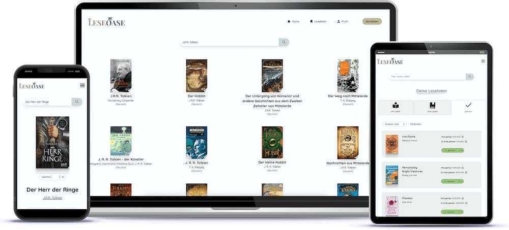

# LESEOASE: Book Tracker



**LESEOASE** is a user-friendly Book Tracking App designed for book enthusiasts to manage and organize their reading journey.

**IMPORTANT: The app is in german**

## Features (work in progress)

### Currently Implemented:

- **Search for Books**: Users can search for books by title, author and ISBN using the Google Books API.
- **Reading Lists**: Users can categorize books into _Reading_, _Read_, and _TBR_ lists.
- **Track Progress**: Users have the ability to log their reading progress by entering the current page.
- **User Profile**: User can change the password and reset a password if it has been forgotten.

### Upcoming Features:

- **Rate**: After finishing a book, users will be able to rate the book.
- **Statistics**: User will be able find reading statistics in their profile.
- **Reading Goal**: User will be able to set a reading goal.
- **Share Button**: User will be able to share book links.
- **Advanced Search**: User will be able to make more specific searches.
- **Filter Results**: User will be able filter the search results by language.

## Technologies Used (so far)

- **Frontend**: HTML, CSS, Javascript, React.js
- **Backend**: Node.js, Express.js
- **Database**: MongoDB, Mongoose
- **API**: Google Books API

## Installation

To get a local copy of the project up and running, follow these steps:

1. clone the repository
2. install the dependencies: `npm install`
3. create a .env.development file in the frontend directory and add the following variables (replace with your data):

```
NODE_ENV=development
VITE_GOOGLE_BOOKS_API_KEY=your_api_key
VITE_BACKEND_URL=http://localhost:3000
```

4. create a .env.production file in the frontend directory and add the following variables (replace with your data):

```
NODE_ENV=production
VITE_GOOGLE_BOOKS_API_KEY=your_api_key
VITE_BACKEND_URL=your_server_domain
```

5. create a .env.development file in the backend directory and add the following variables (replace with your data):

```
NODE_ENV=development
DB_URI=your_mongodb_connection_string
SECRET=your_secret
COOKIE_SECURE=false
HOST=your_mail_host
SMTP_PORT=your_mail_host_port
EMAIL_USER=your_email
EMAIL_PW=your_email_password
BACKEND_URL=http://localhost:3000
FRONTEND_URL=http://localhost:5173
```

5. create a .env.production file in the backend directory and add the following variables (replace with your data):

```
NODE_ENV=production
DB_URI=your_mongodb_connection_string
SECRET=your_secret
COOKIE_SECURE=false
HOST=your_mail_host
SMTP_PORT=your_mail_host_port
EMAIL_USER=your_email
EMAIL_PW=your_email_password
BACKEND_URL=your_backend_domain_url
FRONTEND_URL=your_frontend_domain_url
```

6. cd to frontend directory and start: `npm run dev`
7. cd to backend directory and start the server: `npm run dev`
8. Open your browser and navigate to: <http://localhost:5173>

## Contact

For questions or feedback, please contact:

- Email: <info@natgian.com>
- GitHub: [natgian](https://github.com/natgian)
